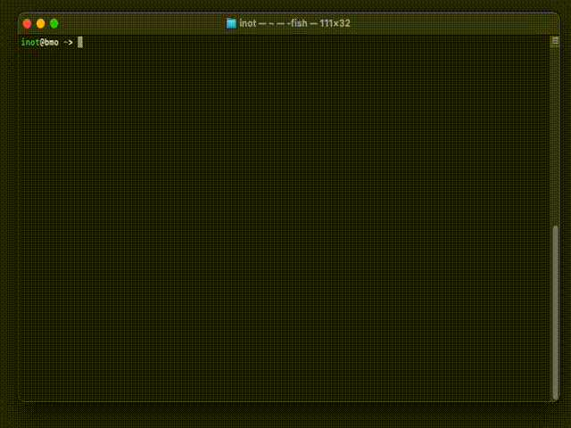

# fvf

A fast interactive finder for HashiCorp Vault KV secrets. Think “fzf for Vault”. 100% Vibecoding.

- Interactive TUI to filter secrets across KV v1/v2.
- Lazy value preview in the right pane.
- Script-friendly plain or JSON output.



## Requirements

- HashiCorp Vault access
- Environment:
  - VAULT_ADDR (e.g., <https://vault.example.com:8200>)
  - VAULT_TOKEN (or export a token from your auth flow)

## Usage

### Basic usage

Set Vault environment and run fvf:

```sh
export VAULT_ADDR="https://vault.example.com:8200"
export VAULT_TOKEN="...your token..."

# Start interactive TUI (default)
./fvf

# Force interactive TUI (streaming by default)
./fvf -interactive
```

### Advanced Usage

- No flags: interactive TUI

  ```sh
  ./fvf
  ```

  - Type to filter; Up/Down to navigate; Enter prints secret value.
  - Right pane shows value preview (when available).

- Interactive streaming (default in interactive mode; progressive results, faster startup):

  ```sh
  # Interactive is default with no flags
  ./fvf
  # Or explicitly force interactive
  ./fvf -interactive
  # Can be combined with -values or -json for preview mode
  ./fvf -interactive -values
  ```

- Interactive with values:

  ```sh
  ./fvf -values
  ```

  - If stdout is a TTY, launches TUI with lazy value preview and fetch-on-select.
  - If stdout is NOT a TTY (e.g., piping), prints all paths with values.

- Specific path:

  ```sh
  ./fvf -path secret/
  ./fvf -path kv/
  ./fvf -path kv/app/
  ```

- Multiple start paths:

  ```sh
  # Comma-separated list
  ./fvf -paths kv/app1/,kv/app2/

  # You can still use -name/-match filters and -values
  ./fvf -paths kv/app1/,kv/app2/ -values
  ```

- Listing all KV mounts without explicit -path:

  ```sh
  # Attempts sys/mounts first, falls back to sys/internal/ui/mounts on 403
  ./fvf
  ```

- Name and regex filters:

  ```sh
  ./fvf -name conf
  ./fvf -match '^secret/.*/config$'
  ```

- JSON output:

```sh
./fvf -json
```

- On a TTY, `-json` opens the interactive UI and shows pretty-printed JSON in the preview.
- When stdout is not a TTY (e.g., piping), prints a JSON array to stdout.

- KVv2 control:

  ```sh
  ./fvf -kv2
  ./fvf -force-kv2
  ```

- Depth and timeout:

  ```sh
  ./fvf -max-depth 2 -timeout 45s
  ```

#### Flags

- -path string          Start path to recurse (default: all KV mounts)
- -paths string         Comma-separated list of start paths (e.g., kv/app1/,kv/app2/)
- -kv2                  Assume KV v2 (default). If unsure, leave as-is
- -kv1                  Assume KV v1 (overrides -kv2 and skips detection)
- -force-kv2            Force KV v2 and skip auto-detection
- -match string         Regex on full logical path
- -name string          Substring match on last path segment
- -values               Print values (interactive preview when stdout is a TTY; raw-friendly output otherwise)
- -max-depth int        Max recursion depth (0 = unlimited)
- -json                 Output JSON array (TTY: opens interactive with JSON preview)
- -timeout duration     Total timeout (default 30s)
- -interactive          Force interactive TUI (interactive streams results by default)
- -version             Print version and exit

## Requirements for Build

- Go 1.20+ (module currently targets Go 1.24)

## Build

- Host build:

  ```sh
  make build
  ```

  Outputs: `dist/fvf`

- Cross-compile (macOS arm64, Linux amd64/arm64, Windows amd64):

  ```sh
  make build-all
  ```

  Outputs in `dist/`:
  - `fvf-darwin-arm64`
  - `fvf-linux-amd64`
  - `fvf-linux-arm64`
  - `fvf-windows-amd64.exe`

## Versioning

- If [./version] exists, its contents define the version (whitespace trimmed; trailing dots removed).
- Else falls back to `git describe`, else `0.1.0`.
- Build embeds:
  - `main.version`, `main.commit`, `main.date`

Check version:

```sh
./fvf -version
```

## Makefile targets

- build — host build into `dist/fvf`
- build-all — cross-compile for macOS arm64, Linux amd64/arm64, Windows amd64
- macos-arm64, linux-amd64, linux-arm64, windows-amd64 — individual targets
- clean — remove `dist/`

Override version metadata at build:

```sh
VERSION=1.2.3 COMMIT=$(git rev-parse --short HEAD) DATE=$(date -u +%Y-%m-%d) make build
```

## Macos security override

```bash
sudo xattr -dr com.apple.quarantine dist/fvf
```

## Notes

- TTY-aware behavior for `-values`:
  - TTY stdout → TUI with preview
  - Non-TTY stdout → prints values for all matches
- KV v2 detection happens per mount unless `-force-kv2`.
- Limited permissions (403 on `sys/mounts`): `fvf` falls back to `v1/sys/internal/ui/mounts`.
  If both calls fail, target a known mount with `-path`. KV v2 is default; for KV v1 add `-kv1`:

```sh
# KV v2 (default)
fvf -path kv/ -values

# KV v1
fvf -path secret/ -kv1 -values
```

## License

MIT

## Changes

- Multi-path support via `-paths` (comma-separated start paths).
- Robust mount discovery: fallback to `v1/sys/internal/ui/mounts` when `sys/mounts` is forbidden (403), with parsing that merges sectioned responses.
- KV handling:
  - Default to KV v2;
  - `-kv1` to force KV v1;
  - `-force-kv2` to skip detection and force v2;
  - Per-mount KV v2 detection when listing across mounts.
- Removed `-debug-mounts` flag after validating fallback discovery.
- Docs updated: usage examples for `-paths`, notes about fallback behavior.
- Interactive: pressing Enter prints only the secret value (JSON), not the path or "path = value".
- Values output: print raw string values by default (no JSON escaping) for better copy/paste; complex nested structures still fall back to JSON.
- Interactive preview: added a separator under the selected path and render values as a two-column Key/Value table when possible for improved readability.
- JSON preview mode: when `-json` is used on a TTY, the interactive preview shows pretty-printed JSON; non-interactive `-json` output remains unchanged.
- Interactive trigger: when stdout is a TTY, passing either `-values` or `-json` will launch the interactive UI with a preview pane.
- Streaming UI is now the default behavior for interactive mode; the `-stream` flag was removed.
- Interactive list: highlight matched query substrings in results (white on gray; bold when selected).
- Tests: added unit tests for UI helpers and value formatting.
- Status bar: added bottom bar with left/middle/right segments — token TTL (left), Vault server (middle), app version (right).
- TTL formatting: humanized long durations (years/months/weeks/days/hours/minutes/seconds) with up to 3 components (e.g., `31d 23h 36m`).
- TTL refresh: cached with periodic refresh (~10s) to avoid excessive API calls.
- Auto-exit on idle + expired token: when the Vault token TTL reaches 0 and there is no user activity for 5 minutes, the TUI exits automatically.
- Certificate preview: PEM-like values (certs/keys) are displayed as multi-line, indented blocks in `-values` preview for readability.
- Table wrap: in wrap mode with `-values`, wrapped text aligns under the value column to preserve the table layout.
- Added in-memory caching for user policies to reduce Vault API calls
- Fixed UI test cases to match actual table rendering output
- Improved table alignment and key-value formatting consistency
